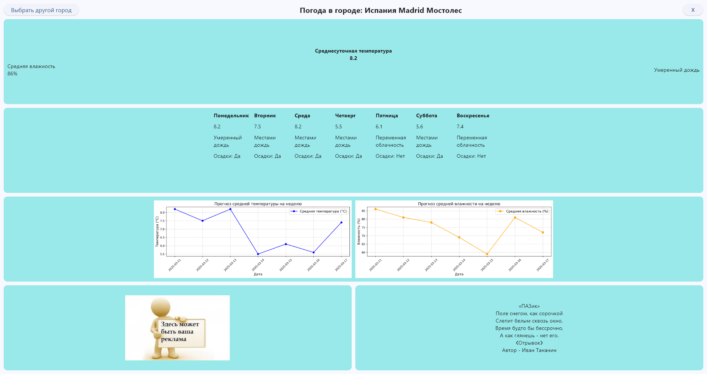

# Приложение прогноза погоды
Простое приложение для просмотра прогноза погоды на неделю, используя API OpenWeatherMap.
 
 Функциональность:
1) Умный поиск города: Автоматически уменьшающийся список городов при вводе названия.
2) Прогноз на неделю: Средняя температура, влажность и погодные условия по дням.
3) Визуализация: Графики температуры и влажности.
   
   
   
 Технологии: Python, Flet, OpenWeatherMap API, Requests, JSON.

 Авторы: Грибков Дмитрий, Лещенко Андрей, Тананин Иван.
